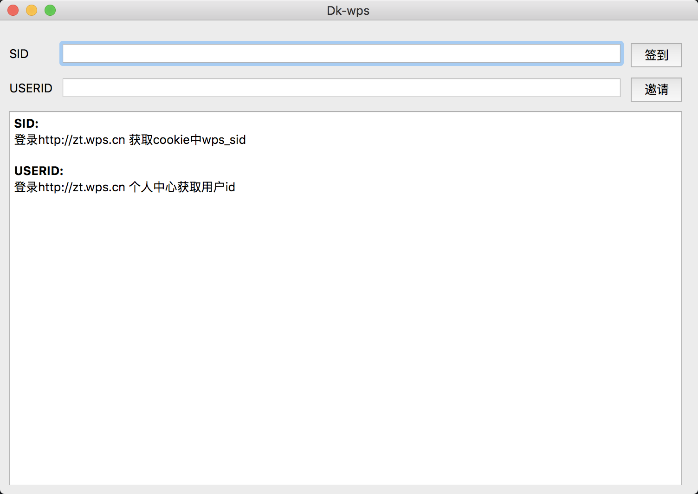

## :rainbow: Dk-wps 
[](https://github.com/4rat/Dk-wps) 

> [wps活动地址](https://zt.wps.cn)
> 
> 官方活动: 不定时失效



## :gear: 使用说明
> 提供两种签到邀请方式  `py脚本、GUI程序` 可根据个人喜好自行选择

`1. /py` 脚本
```
api = "https://sc.ftqq.com/[your-key].send"
```
配置 Server酱api
```
main(sid='sid', userid='userid')
```
配置 sid签到配置项、userID邀请配置项
```
python3 Dkwps.py
```
运行

`2. /GUI` 程序
```
pyinstaller -F -w --icon logo.ico Dkwps.py
```
手动打包程序

## :robot:建议
> 建议使用`py`脚本，配合Crontab定时执行，打卡成功后每天server酱会打卡提醒；
> 
> 如使用GUI图形化工具，可在Download链接下载打包完成的程序。


## :desktop_computer: Download
[Dkwps-GUI工具 ](https://github.com/4rat/Dk-wps/releases)

## :space_invader:其他
遇到任何问题，请提交Issues